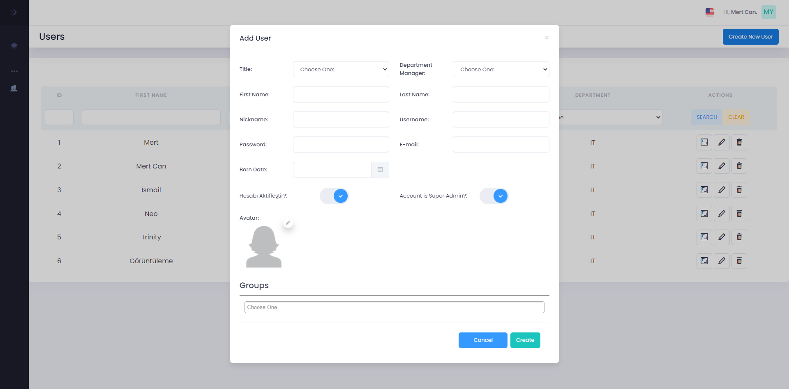

# MIM
## _The Web Application designed in .NET Framework 4.8_

MIM is modular web application project that designed in .NET Framework with using MVC design pattern. Summary, This web application is designed to virtualize the organizational structures.

## Features
- MVC with Codefirst EntityFramework.
- Used Bootstrap Modal Form for best user experience.
- English/Turkish localization. 
- Modular database relationship.
- You can use create, read, update, and delete (CRUD) operations.

Database relationship has been created with Entity Framework 6 (Codefirst Approach). In database relationship we have 3 different types of relations in this database: _one-to-one_, _one-to-many_, and. _many-to-many_. (new sql table like _GroupUsers_ etc.).

The database has been created flexibly (effortless to add new tables) for easy to use by all companies that will be use this web application. Right now  there are 6 SQL table models _(Department, Grant, Group, License, Module, Organization, Title and User)_ in the database and also there will be new models to be added for modular database structure in the future.

We adhered to the SOLID principle. In this way:

- The software we develop easily adapts to the future requirements, 
- We can easily add new features without the need for a change in the code.
- It provides the least change on the code despite new requirements,
- It is to minimize the time loss caused by problems such as constant correction or even rewriting on the code.


> As mentioned above we used Generic Methods.
> Generics are a structure that allows the interface, 
> interface, class, method or parameters (arguments)
> we designed to work for every type that fits 
> a template structure, not for a specific type.

## Tech

MIM uses a number of projects to work properly:

- [Ajax/jQuery](https://jquery.com/) - jQuery is a fast, small, and feature-rich JavaScript library.
- [ASP.NET MVC](https://dotnet.microsoft.com/en-us/apps/aspnet/mvc) A design pattern for achieving a clean separation of concerns
- [Bootstrap Modal](https://getbootstrap.com/docs/4.0/components/modal/) - Powerful, extensible, and feature-packed frontend toolkit.
- [Chart.js](https://www.chartjs.org/) - Simple, clean and engaging HTML5 based JavaScript charts. Chart.js is an easy way to include animated, interactive graphs on your website for free.
- [EntityFramework](https://www.entityframeworktutorial.net/what-is-entityframework.aspx) - EntityFramework is an open-source ORM framework for .NET applications supported by Microsoft.
- [FluentValidation](https://docs.fluentvalidation.net/en/latest/) - FluentValidation is a .NET library for building strongly-typed validation rules.
- [MSSQL](https://www.microsoft.com/en-us/sql-server/sql-server-2019) - MSSQL is a relational database management system developed by Microsoft.
- [PagedList](https://github.com/troygoode/PagedList) - PagedList is a library that enables you to easily take an IEnumerable/IQueryable, chop it up into "pages", and grab a specific "page" by an index. 
- [Newtonsoft.Json](https://www.newtonsoft.com/json) - Popular high-performance JSON framework for .NET


## How To Use

MIM requires Visual Studio 2019 or 2022 and also needs Microsoft SQL Server 2019.

> Important Note: If you are using Visual Studio 2022,
> you must update the latest version of EntityFramework (6.4.4) from Nuget Packages.
> Also don't forget to check .NET Framework Version. (v4.8 the latest one)

| Visual Studio | Entity Framework |
| ------ | ------ |
| 2019 | v6.1.3 |
| 2022 | v.6.4.4 |

First of all you need to open _Package Manager Console_ if you don't know how to open it: (from View -> Other Windows -> Package Manager Console).

In Package Manager Console write the code below for creating a database.

```sh
update-database
```

> If you get a problem you need to look at the _Web.config_ file. Scroll down and find the _name=localhost_ write your username in SQL Server from the code below.

```sh
<add name="LOCAL" connectionString="Data Source=<YourComputerName>;Initial Catalog=MIMDB;Integrated Security=true" providerName="System.Data.SqlClient" />
````

Because the option _AutomaticMigrationsEnabled_ has enabled in Configuration file you don't need to add new migration.
```sh
AutomaticMigrationsEnabled = true;
``` 

PM will check the migrations in the project. Then Boom! Now you are ready to go!

Now you can start the project in Visual Studio. And you will see the Login Page. In SQL Server Management Studio (SSMS) look at the database which named 'MIM' then in Users table you can see the users created from Seed. Select one of them and write down Username and Password. You will be in the Index Page. 

Look at the Aside Bar. Scroll the mouse on it and you will see the Informations about the Models (Users, Titles, Departments and Groups). Click the one of them and the showing page you can use the CRUD operations.

> Important Note: If you are not SuperAdmin or if you don't have any grants you can not see CRUD operations from models. Trying to solve this you should write 1 in SuperAdmin column in SQL Database.

There is a text and a symbol in the upper right corner of the page. When you click on it, a window will open. You can get information about the logged in user from this window.

You can change the language via changing the flag symbol. 

# Upcoming Features

As mentioned above due to sticking with SOLID principle we can add new features. Here is the plan.

- [SignalR](https://dotnet.microsoft.com/en-us/apps/aspnet/signalr) - SignalR in ASP.NET lets your server-side code push content to connected clients, in real-time, with client SDKs for JavaScript, .NET
- More charts from chart.js


# Screenshots from project





